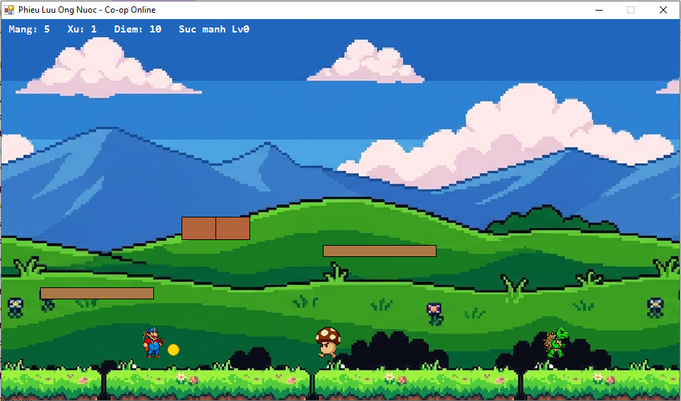

# Phieu Luu Ong Nuoc - Co-op Online

  

Game platformer 2 nguoi choi (nhay dau quai, thu thap xu, nem lua) chuyen the tu du an
`GamePvP-Contra`, tai su dung nguyen ven tang mang P2P (`NetworkPeer.vb`, giao thuc
STATE/INPUT pipe-delimited, host authoritative). Nhan vat, quai va ten goi trong game
la thiet ke goc, khong dung ten/hinh anh nhan vat thuong hieu cua ben thu ba - chi lay
cam hung ve loi choi (chay - nhay - dam dau quai - nem lua - an xu - dam khoi "?").

## Cach choi

- Do phan giai man hinh: **960x540** (chuan 16:9)
- Man hinh mo dau co 3 lua chon: **Choi 1 nguoi (Solo)** - choi offline khong can mang,
  **Host** - tao phong cho nguoi thu 2 vao, **Join** - vao phong nguoi khac da tao.
  Che do Solo tat han Nguoi choi 2 (khong hoi sinh, khong hien tren man hinh/HUD), dieu
  kien thua/thua cuoc van hoat dong binh thuong voi 1 nguoi.
- **Di chuyen**: mui ten Trai/Phai hoac A/D
- **Nhay**: Space, Up/W hoac Z
- **Nem lua** (chi khi da co suc manh Lv2): Ctrl hoac X
- **Chui vao ong nuoc**: dung tren dinh 1 "ong Warp" roi bam Xuong/S (co mui ten trang bao hieu)

### Cot co & khung thanh
Cuoi man co cot co + khung thanh + cong chua (thiet ke goc, khong dung ten/hinh anh
nhan vat thuong hieu). Cham vao cot co la thang man ngay (khong bat buoc phai ha guc
trum cuoi truoc), diem thuong cang cao neu cham cot o vi tri cang cao - giong co che
"height bonus" cua dong game Mario kinh dien. Sau khi thang, co ha xuong va cong chua
hien ra truoc cong thanh.

### He thong suc manh (WeaponLevel)
- **Lv0 - Nho**: mac dinh, chi can 1 don trung la mat mang
- **Lv1 - To** (an Nam): chiu duoc 1 don truoc khi mat mang, chua nem lua duoc
- **Lv2 - Lua** (an Hoa): nem duoc fireball (nay tren mat dat, gioi han so luong tren man
  hinh cho moi nguoi choi), van chiu duoc 1 don truoc khi rot ve Lv1

### Quai vat
- **Quai di bo**: dam dau la tieu diet ngay, cham canh se gay sat thuong
- **Quai co mai**: dam dau lan 1 -> thu vao mai (bat dong); cham vao mai dang dung se
  da no lan di, mai lan se tieu diet quai khac tren duong di va gay sat thuong cho nguoi
  choi neu cham phai luc dang lan (dam dau len mai dang lan se lam no dung lai)
- **Trum cuoi man**: nhieu mau, thinh thoang nha fireball ve phia nguoi choi gan nhat;
  dam dau nhieu lan hoac ban trung bang fireball de ha guc -> thang man

### Khoi "?" va vat pham
- Nhay dam dau tu duoi len vao khoi mau vang co dau "?" se bung ra vat pham (xu, nam,
  hoa lua hoac 1-up), moi khoi chi dung duoc 1 lan
- Nhat du 100 xu se duoc +1 mang chung (tuong tu he thong Mang song chung trong ban Contra)

## Kien truc ky thuat

- **PlatformGame.vb**: toan bo logic gameplay (vat ly nhay/roi, va cham platform 2 chieu
  ca tu tren va tu duoi len, fireball co trong luc + nay, AI quai, dam dau/da mai, khoi "?",
  serialize/deserialize giao thuc mang). Host chay `Tick()` moi 33ms, client chi ap dung
  `ApplyStateLine()` de ve hinh.
- **Form1.vb**: UI Host/Join, doc phim, ve hinh GDI+ (uu tien sprite trong `Assets/` neu co,
  tu dong fallback hinh khoi mau khi thieu file).
- **NetworkPeer.vb**: khong doi so voi ban Contra, TCP P2P thuan tuy dong/nhan tung dong text.
- **Platforms tat dinh**: `BuildLevel1()` khong dung Random nen Host/Client tu sinh ra cung
  mot ban do; giao thuc mang chi can dong bo vi tri nguoi choi/quai/fireball/vat pham va
  1 chuoi bit danh dau khoi "?" nao da dung, khong can gui lai toan bo dia hinh.

## Build

Chay `build_platform.bat` (dung `vbc.exe` cua .NET Framework 4.x co san trong Windows,
khong can Visual Studio). Sau khi build xong, dat thu muc `Assets/` cung cho voi file .exe.

## Assets

Thu muc `Assets/` tai su dung cac file PNG tu du an Contra (player0/1, enemy_soldier lam
quai di bo, enemy_boss lam trum cuoi, tile_ground, bullet_player/enemy lam fireball,
powerup_weapon/life). Rieng quai co mai va khoi gach/khoi "?" hien dang dung fallback
GDI+ (hinh khoi mau) vi chua co sprite rieng - ban co the tu ve/them PNG tuong ung neu
muon (xem ten file can trong `LoadSpritesIfExist()` o Form1.vb) ma khong can sua code.
